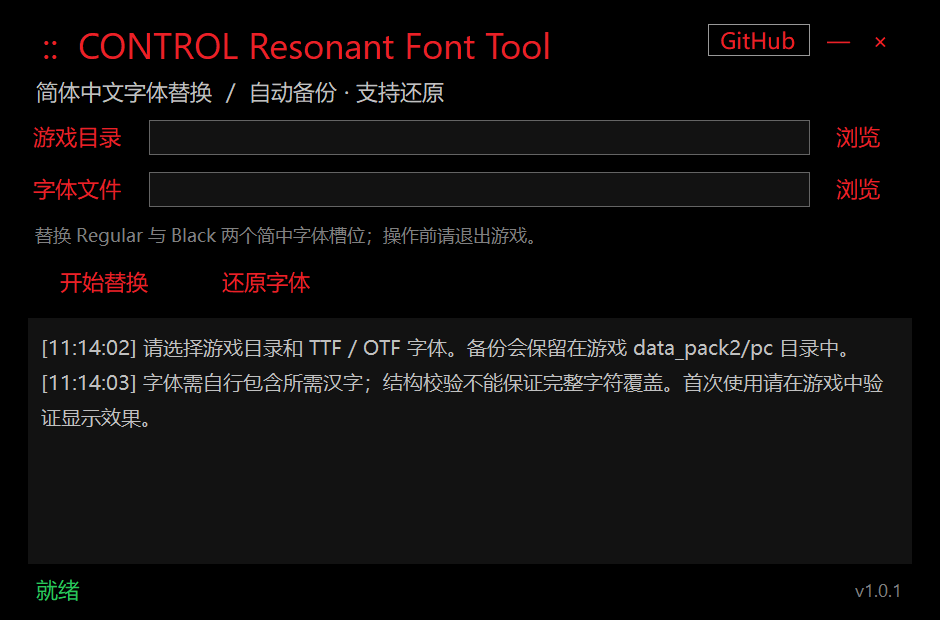

# CONTROL Resonant Font Tool

简体中文 | [English](#english)

独立的《控制：共振》（CONTROL Resonant）简体中文字体替换工具，提供红黑界面、自动备份和字体还原功能。

[](https://github.com/jakeouyang/ControlResonantFontTool/releases)
[](LICENSE)



## 下载

前往 [Releases](https://github.com/jakeouyang/ControlResonantFontTool/releases) 下载最新版压缩包，解压后直接运行 `ControlResonantFontTool.exe`。无需同目录 DLL 或额外安装运行环境，运行所需的原生组件会自动释放到系统临时缓存。

## 使用方法

1. 退出游戏，选择游戏根目录或 `data_pack2/pc`。
2. 选择包含所需汉字的独立 TTF / OTF 字体，点击“开始替换”。Regular 与 Black 两个简中字体槽位使用同一字体。
3. 点击“还原字体”恢复首次替换前的状态。请保留游戏 `data_pack2/pc` 下的 `_fonttool_backup` 文件夹。

支持 TTF 和含 CFF 轮廓的 OTF，不支持 TTC 字体集合。字体结构校验不代表完整汉字覆盖，请在游戏中确认显示效果。

## 备份与兼容

- 已有兼容备份会自动沿用并统一目录名称，无需手动改名。发现多份可能冲突的备份时，程序会停止操作，保留所有备份。
- 没有可用的替换记录时无法还原。请确认选择了正确的游戏目录，并保留完整备份。
- 当前游戏文件与历史备份不一致时，程序会拒绝替换。请先恢复此前的修改；若游戏已更新，请验证游戏文件，并将历史备份移到游戏目录外妥善保留。不要用旧备份覆盖更新后的游戏文件。
- 若此前使用的工具生成了不同格式的备份，请使用当时的工具恢复该次修改。
- 包含简中字体的开发包 MOD 可能覆盖本工具的替换效果，使用前请先停用冲突的字体 MOD。
- 游戏更新或其他工具改变资源索引后，程序会拒绝自动还原，避免覆盖其他修改。

本工具直接更新基础资源索引，使用独立字体资源文件；不生成开发包 MOD，不覆盖或截断原游戏资源包，也不修改其他工具。

## 从源码构建

需要 .NET 9 SDK（Windows）：

```bash
dotnet publish -c Release
```

产物为单文件自包含的 `ControlResonantFontTool.exe`。发布时 GitHub Actions 会自动构建并上传到 Releases：推送 `v*` 标签即可触发。

## 验证情况

已通过隔离环境中的字体替换、重复替换、还原一致性、异常中断恢复及备份冲突检查，并由独立解析器验证导出内容。游戏内效果尚未在本仓库 CI 中验证，欢迎通过 [Issues](https://github.com/jakeouyang/ControlResonantFontTool/issues) 反馈。

## 许可证

本项目基于 [MIT License](LICENSE) 开源。

---

# English

Standalone Simplified Chinese font replacement tool for CONTROL Resonant, with a red-and-black interface, automatic backup, and restore.


## Download

Get the latest archive from [Releases](https://github.com/jakeouyang/ControlResonantFontTool/releases) and run `ControlResonantFontTool.exe`. No companion DLLs or additional runtime installation are required; native runtime components are automatically extracted to the system temporary cache.

## Usage

1. Close the game, select its root folder or `data_pack2/pc`.
2. Choose a standalone TTF/OTF font containing the required Chinese glyphs and click Replace. Both SC Regular and Black slots use the selected font.
3. Click Restore to roll back to the state before the first replacement. Keep the `_fonttool_backup` folder under `data_pack2/pc`.

TTF and OTF with CFF outlines are supported; TTC collections are not. Structural validation does not guarantee full glyph coverage — verify in-game rendering.

## Backup & Compatibility

- Existing compatible backups are recognized and migrated automatically; ambiguous backups block the operation without touching either copy.
- Restore requires a complete replacement record and backup.
- If the current game files no longer match the stored backup, replacement and restore are refused. Restore previous edits first, or verify game files after an update and keep old backups outside the game folder.
- Backups produced by other tools in a different format must be restored with the tool that created them.
- Development mods containing SC fonts may override this tool's replacement; disable conflicting font mods first.
- After a game update or resource-index changes by other tools, automatic restore is refused to avoid overwriting other modifications.

The tool patches the base resource index and uses a standalone font blob; it does not create development mods, never overwrites or truncates original game blobs, and does not modify other tools.

## Building from Source

Requires the .NET 9 SDK on Windows:

```bash
dotnet publish -c Release
```

The output is a self-contained single-file `ControlResonantFontTool.exe`. GitHub Actions builds and attaches artifacts to Releases automatically on `v*` tag pushes.

## Validation

Offline replacement, repeated replacement, restore consistency, interrupted-transaction recovery, and backup-conflict checks passed in an isolated environment, with exported content verified by an independent parser. In-game behavior is not covered by CI — feedback via [Issues](https://github.com/jakeouyang/ControlResonantFontTool/issues) is welcome.

## License

Released under the [MIT License](LICENSE).
